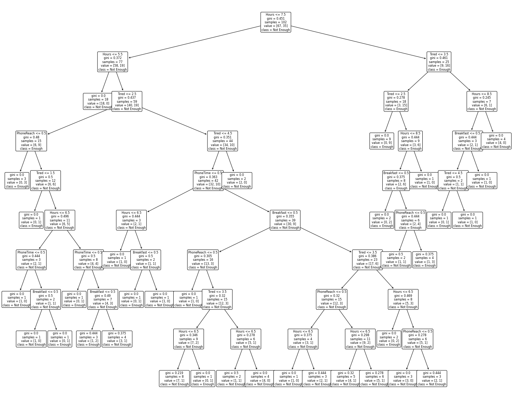

# Sleep Patterns

This is my first time doing machine learning. What I wanted to do is to check how some conditions affect the feeling of having enough of sleep.

The notebook reads the input data, normalizes it, generates a decision tree and the accuracy score, and then outputs it to the screen.

The datasets are taken from [here](https://www.kaggle.com/mlomuscio/sleepstudypilot).

## Decision Tree



Decision tree is quite big. That's most probably because of the little amount of input parameters.

## Average Values

Some information about data:
- Used phone before bed: 0 for 'no', 1 for 'yes'
- Phone time: 0 for 'no', 1 for 'yes'
- Tired: from 1 to 5
- Had breakfast: 0 for 'no', 1 for 'yes'

For having enough of sleep:
- Hours of sleep: 7.4
- Used phone before bed: 0.657
- Phone time: 0.8
- Tired: 2.5
- Had breakfast: 0.6857

For having not enough of sleep:
- Hours of sleep: 6.268
- Used phone before bed: 0.716
- Phone time: 0.82
- Tired: 3.388
- Had breakfast: 0.55

What I see in this data is that:
1. In average, for having enough of sleep, more sleep hours needed (approximately 7+ hours)
2. Using phone before bed can impact your sleep in a bad way (probably due to screen's 'blue light')
3. If you are too tired, you might need more sleep (kind of obvious, but that's what can be seen here)
4. Having breakfast might have a good impact on your sleep (but not certainly)

## Development

### Requirements

- Python 3
- Jupyter
- Scikit-learn
- Numpy
- Matplotlib
- Pandas

```bash
pip install jupyter scikit-learn numpy matplotlib pandas
```

### Setup

1. Clone the repository

```bash
git clone https://github.com/ivteplo/sleep-patterns
```

2. Navigate to the folder

```bash
cd sleep-patterns
```

3. Start the Jupyter server

```bash
jupyter notebook
```

4. Happy hacking 🎉
